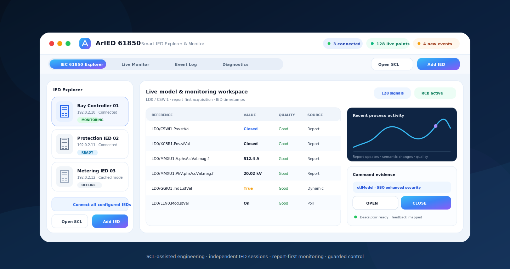

<div align="center">
  

# ARSAS

### One application for practical IEC 61850 engineering

**MMS · Reporting · GOOSE · File Transfer · Sampled Values · SCL · Control · Diagnostics**

ARSAS is an open-source Windows engineering workstation for IEC 61850 testing, commissioning, troubleshooting, model inspection, live monitoring, fault-record retrieval, and evidence-driven control workflows.

[](https://github.com/masarray/arsas/actions/workflows/build.yml)
[](https://masarray.github.io/arsas/)
[](LICENSE)
[](https://dotnet.microsoft.com/)
[](#requirements)

[**Product website**](https://masarray.github.io/arsas/) · [**Capabilities**](#capability-status) · [**Roadmap**](ROADMAP.md) · [**Architecture**](docs/ARCHITECTURE.md) · [**Report an issue**](https://github.com/masarray/arsas/issues)
</div>



## Why ARSAS

IEC 61850 FAT, SAT, commissioning, and troubleshooting often require several disconnected tools, repeated model preparation, manual DataSet or RCB work, and significant setup before the first useful value appears.

ARSAS is being built as a single focused workspace: enter an IED endpoint or open an SCL project, discover the live MMS model, select signals, monitor values and reports, inspect GOOSE and Sampled Values traffic, retrieve COMTRADE fault records, validate control behavior, and preserve diagnostic evidence without constantly switching applications.

The protocol engine lives in the separately maintained [ARIEC61850](https://github.com/masarray/ARIEC61850) repository. ARSAS remains the application, workflow, visualization, and operator-experience layer.

## Capability status

ARSAS uses explicit maturity labels so the public documentation does not confuse implemented features with the long-term product direction.

| IEC 61850 area | Status | Current scope |
|---|---|---|
| **MMS client and model discovery** | Available | Association, Logical Devices, Logical Nodes, Data Objects, Data Attributes, values, quality, timestamps, DataSets, RCBs, type information, and diagnostics. |
| **Reporting and live monitoring** | Available | Static and dynamic report planning, report-first acquisition, bounded polling fallback, multi-IED monitoring, SOE, and persisted signal selections. |
| **GOOSE subscriber** | Available | Read-only Npcap capture, stream supervision, APPID/VLAN/MAC metadata, `stNum`/`sqNum`, ordered `allData`, and SCL/live-model binding. |
| **IEC 61850 file transfer** | Available | Bounded MMS file-service browsing and download workflows for disturbance and COMTRADE fault-record retrieval. |
| **Smart Control** | Available | Live `ctlModel` discovery, typed Direct and Select-Before-Operate sequences, command termination, error evidence, and process feedback. |
| **SCL workspace** | Available | SCD/CID/ICD/IID/SSD import, endpoint extraction, configured-to-live comparison context, and Edition 1/2-oriented export services. |
| **Sampled Values / SMV** | Engineering preview | Per-IED stream entry points and viewer workflow; deeper decoding, quality supervision, validation, and performance work remain active. |
| **Full SCL generation** | Roadmap | A visual project-authoring workflow for IED, communication, DataSet, report, GOOSE, Sampled Values, and export generation. |
| **Unified IEC 61850 suite** | Product direction | A complete engineer-facing environment for MMS, GOOSE, file services, Sampled Values, SCL engineering, diagnostics, testing, and evidence export. |

See [ROADMAP.md](ROADMAP.md) for milestones, definitions of done, and non-goals.

## Practical engineering workflow

```text
Open SCL / Open Project / Add IED by IP address
                         ↓
Discover or restore the live IEC 61850 model
                         ↓
Select signals and control-ready Data Objects
                         ↓
Start report-first monitoring per IED
                         ↓
Inspect GOOSE / SMV / reports / SOE / diagnostics
                         ↓
Retrieve fault records through MMS file services
                         ↓
Validate guarded control and export test evidence
```

## Core capabilities

### Live MMS engineering

- Independent MMS association and lifecycle per IED.
- Live discovery of model hierarchy, values, quality, timestamps, DataSets, RCBs, control blocks, and type descriptors.
- Searchable and virtualized signal workspace for large IED models.
- Configured SCL context retained beside observed live behavior.

### Report-first monitoring

- Prefer usable report coverage before polling.
- Preserve DataSet order and report reason evidence.
- Build temporary dynamic coverage where supported.
- Keep bounded polling only for uncovered or unverified signals.
- Coalesce UI updates to remain responsive across multiple devices.

### GOOSE and Sampled Values

- Read-only GOOSE capture through the ARIEC61850 Npcap transport.
- Stream identity, VLAN, APPID, sequence, retransmission, TAL, and model-binding diagnostics.
- Ordered `allData` presentation without silently truncating model/frame mismatches.
- Sampled Values viewer workflow under active engineering development.

### Fault-record file transfer

- Browse the IED MMS file service from the selected device context.
- Download disturbance files and COMTRADE-related records with bounded operations.
- Keep transfer diagnostics attached to the originating IED session.
- Avoid embedding customer-specific paths or assumptions in the application layer.

### Control with evidence

- Discover `ctlModel` before enabling an operation.
- Resolve live `Oper`, `SBOw`, and optional `Cancel` descriptors.
- Execute supported Direct or Select-Before-Operate sequences.
- Preserve origin, `ctlNum`, timestamp, Test, interlock, and synchrocheck context.
- Surface `CommandTermination`, `ControlError`, `AddCause`, `LastApplError`, timing, and mapped process feedback.

## Architecture

```text
┌──────────────────────────────────────────────────────────────────────┐
│                                ARSAS                                 │
│ Explorer · Monitor · SOE · GOOSE · SMV · Files · SCL · Control · UX │
└─────────────────────────────────┬────────────────────────────────────┘
                                  │ typed application services
┌─────────────────────────────────▼────────────────────────────────────┐
│                             ARIEC61850                               │
│ MMS · Reporting · GOOSE · SMV · File Services · SCL · Control       │
│ Transport · Type System · Diagnostics · Protocol Validation          │
└────────────────────────┬──────────────────────┬───────────────────────┘
                         │ TCP/102              │ Ethernet process bus
                    Laboratory IEDs         Approved capture network
```

Detailed design notes are maintained in [docs/ARCHITECTURE.md](docs/ARCHITECTURE.md) and [ENGINE_COMPATIBILITY.md](ENGINE_COMPATIBILITY.md).

## Quick start

### Requirements

- Windows 10 or Windows 11
- .NET 8 SDK
- Visual Studio 2022 with **.NET desktop development**, or the .NET CLI
- A compatible ARIEC61850 source checkout
- Npcap for raw-Ethernet GOOSE and Sampled Values workflows
- An isolated laboratory or approved commissioning network

### Recommended folder layout

```text
D:\Git\
├─ ARIEC61850\
│  └─ src\
│     ├─ AR.Iec61850\AR.Iec61850.csproj
│     └─ AR.Iec61850.Transports.Npcap\AR.Iec61850.Transports.Npcap.csproj
└─ arsas\
   └─ ArIED61850Tester.csproj
```

### Build

```powershell
git clone https://github.com/masarray/ARIEC61850.git
git clone https://github.com/masarray/arsas.git

cd arsas
dotnet restore .\ArIED61850Tester.csproj
dotnet build .\ArIED61850Tester.csproj -c Release
```

For a non-sibling engine checkout:

```powershell
dotnet build .\ArIED61850Tester.csproj -c Release `
  -p:ArIec61850Project="D:\Engineering\ARIEC61850\src\AR.Iec61850\AR.Iec61850.csproj" `
  -p:ArIec61850NpcapProject="D:\Engineering\ARIEC61850\src\AR.Iec61850.Transports.Npcap\AR.Iec61850.Transports.Npcap.csproj"
```

## Documentation

| Document | Purpose |
|---|---|
| [Roadmap](ROADMAP.md) | Product direction from the current engineering workstation to a complete IEC 61850 suite. |
| [Documentation hub](docs/README.md) | Entry point for engineering, validation, legal, and contribution documents. |
| [Architecture](docs/ARCHITECTURE.md) | Runtime ownership, acquisition strategy, protocol boundaries, and scale. |
| [GOOSE Subscriber](docs/GOOSE_SUBSCRIBER.md) | Npcap capture, ordered data, model binding, diagnostics, and validation. |
| [Validation checklist](docs/VALIDATION_CHECKLIST.md) | Build, reporting, control, simulator, and live-test acceptance checks. |
| [Engine compatibility](ENGINE_COMPATIBILITY.md) | Required ARIEC61850 contracts and project-reference layout. |
| [Licensing](docs/LICENSING.md) | Community and commercial licensing paths. |
| [Security policy](SECURITY.md) | Responsible vulnerability reporting. |

## Safety and operational boundaries

IEC 61850 control, report configuration, temporary DataSet creation, file access, and active network functions can affect IED resources or equipment state. Use active features only inside an approved test boundary with suitable isolation, switching authority, procedures, and independent verification.

GOOSE and Sampled Values capture is read-only in ARSAS, but packet capture still requires an approved adapter, network boundary, data-handling policy, and permission to inspect or export station traffic.

ARSAS is an engineering tool. It is not an IEC 61850 conformance certificate, functional-safety certification, cybersecurity approval, or substitute for an approved commissioning procedure.

## Contributing

Focused, reproducible, independently authored contributions are welcome. Do not submit confidential employer, customer, substation, relay-setting, SCL, credential, or packet-capture material.

Read [CONTRIBUTING.md](CONTRIBUTING.md), [SECURITY.md](SECURITY.md), [SUPPORT.md](SUPPORT.md), and [NOTICE.md](NOTICE.md) before contributing or redistributing the software.

## License

The current community edition is licensed under the **GNU General Public License v3.0 or later**. See [LICENSE](LICENSE).

A separately negotiated commercial license is available for proprietary integration, OEM or white-label distribution, closed-source redistribution, warranty, maintenance, priority support, training, and project-specific development. See [COMMERCIAL-LICENSE.md](COMMERCIAL-LICENSE.md).

Names, logos, icons, and official-release branding are not granted by the software license. See [TRADEMARK.md](TRADEMARK.md) and [NOTICE.md](NOTICE.md).

---

<div align="center">
  <strong>ARSAS</strong><br />
  From an IP address or SCL file to trustworthy IEC 61850 evidence—in one engineering workspace.
</div>
