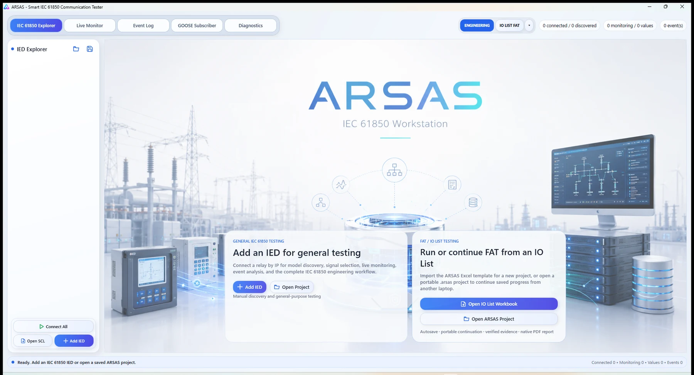

<div align="center">
  

# ARSAS

### From an IED IP address or approved IO List to attributable IEC 61850 evidence

**Discover · Monitor · Test IO Lists · Diagnose · Generate SCL · Export Evidence**

ARSAS is an open-source Windows IEC 61850 engineering workstation for FAT, SAT, commissioning, troubleshooting, and multi-vendor integration. Start from an approved IED endpoint, an SCL file, or an IO List workbook; inspect what the device actually exposes; and preserve the result as attributable engineering evidence.

[](https://github.com/masarray/arsas/actions/workflows/build.yml)
[](https://masarray.github.io/arsas/)
[](https://github.com/masarray/arsas/releases/latest)
[](LICENSE)
[](https://dotnet.microsoft.com/)
[](#system-requirements)

[**Download installer**](https://github.com/masarray/arsas/releases/latest/download/ARSAS-Windows-x64-Setup.exe) ·
[**Portable ZIP**](https://github.com/masarray/arsas/releases/latest/download/ARSAS-Windows-x64-Portable.zip) ·
[**Quick Start**](https://masarray.github.io/arsas/quick-start.html) ·
[**IO List FAT Evidence**](https://masarray.github.io/arsas/io-list-fat-evidence.html) ·
[**Product website**](https://masarray.github.io/arsas/) ·
[**Release notes**](https://masarray.github.io/arsas/release-notes.html) ·
[**Roadmap**](ROADMAP.md)
</div>

<div align="center">
  <a href="Assets/screenshot/arsas-overview-v1.6.19.webp">
    
  </a>
  <br />
  <sub>Choose Engineering for live IEC 61850 discovery or IO List FAT for resumable, reviewable test evidence.</sub>
</div>

> **Current stable release: ARSAS v1.6.19.** The stable Windows package now includes the release-grade IO List FAT workflow, persistent Engineering/FAT workspace switching, executive evidence reporting, one-click GOOSE entry, and bounded one-click SMV snapshot workflow described below.
>
> **Verified publication:** source commit [`990d1d1`](https://github.com/masarray/arsas/commit/990d1d1618704f1b8f4ee39a1d156780077734a7) · installer 51.6 MiB · portable ZIP 70.0 MiB · [SHA-256 checksums](https://github.com/masarray/arsas/releases/latest/download/ARSAS-Windows-x64-SHA256SUMS.txt) · public binaries currently unsigned with Authenticode.

## What changed in v1.6.19

- **Rev.3 IO List import** preserves the exact IEC 61850/event-log reference, source state semantics, document control, report display reference, evidence fields, and review reasons without inventing missing telegrams.
- **Executive FAT evidence report** adds document number, revision, `AS TESTED` issue state, exact event-log reference, expected state, ON/OFF relay timestamps, result summary, test basis, and sign-off areas.
- **Fast workspace switching** keeps a loaded IO List FAT project in memory. Moving between Engineering and IO List FAT uses hide/show; the user only selects another workbook or `.arsas` project when intentionally replacing the loaded project.
- **One-click GOOSE workflow** opens the GOOSE Subscriber from an IED card, resolves the routed Ethernet adapter when unique, and starts receive-only capture.
- **One-click SMV workflow** opens the Sampled Values workspace, selects the first discovered stream, starts a bounded two-cycle capture on the routed adapter, and renders values plus raw waveform evidence.
- **Real preparation progress** follows actual connection, discovery, binding, and acquisition readiness with smoothed determinate progress instead of an infinite animation.
- **Evidence continuity and lifecycle hardening** protect completed FAT rows during continuation, preserve loaded workspace state, and avoid window-show races during application shutdown.

## Why ARSAS stands out

| Engineering problem | ARSAS response |
|---|---|
| Vendor CID or ICD is missing, outdated, or rejected. | Perform complete live MMS discovery and generate a schema-aware **Edition 2 IID** or **Edition 1 ICD** with companion evidence. |
| Reporting setup consumes the test window before values appear. | Read an immediate MMS image, prefer verified BRCB/URCB coverage, recover bounded gaps where permitted, and keep fallback acquisition visible. |
| A multi-IED test loses device ownership and diagnostics. | Maintain an independent association, model, monitoring state, events, files, control context, and diagnostics for every IED. |
| A FAT team must rebuild IO List evidence manually. | Import the approved workbook, bind exact IEC 61850 references, record ordered **OFF → ON → OFF** evidence, and export Excel, native PDF, or a resumable `.arsas` project. |
| GOOSE or SMV analysis requires repeated navigation and adapter selection. | Enter directly from the selected IED card, resolve the routed NIC when it is unique, and start passive capture with a safe manual fallback. |
| Integration failures become vague messages. | Preserve identity, references, DataSet membership, RCB options, protocol stage, negative response, timing, and copyable diagnostic evidence. |

ARSAS shortens the path from **“the IED is reachable”** to **“the engineer has usable, attributable evidence.”** It does not turn an unsupported or ambiguous result into a false success.

## Two connected workspaces

### Engineering Workspace

Use an approved IED IP address or SCL source for complete live discovery, signal selection, reporting, multi-IED monitoring, SOE, GOOSE, SMV, file transfer, SCL workflows, diagnostics, and guarded control.

### IO List FAT Workspace

Import an approved Excel workbook or open a portable `.arsas` project. The workspace keeps only the imported scope, binds the points to live-discovered IEC 61850 references, records ordered transition evidence, and produces customer-facing evidence output.

Once loaded, the FAT workspace remains in memory while the user visits Engineering. Returning to IO List FAT does not reopen Excel or `.arsas`; loading another file is an explicit replacement action.

The automatic IO List test path is read-only toward the IED. It does not issue controls. External simulation, injection, or plant operation still requires an approved procedure and safe test boundary.

## IO List FAT evidence workflow

```text
Approved IO List workbook / portable .arsas project
                        ↓
Strict schema, identity and document-control validation
                        ↓
Exact IEC 61850 and event-log reference binding
                        ↓
Trustworthy OFF baseline
                        ↓
OFF → ON evidence → ON → OFF evidence
                        ↓
PASS / REVIEW / FAIL / PENDING
                        ↓
Excel result · Native executive PDF · Portable .arsas project
```

A point passes only when a new ON transition and its corresponding OFF transition are captured in order. An initial ON image is not accepted as ON evidence. Quality, acquisition source, IED timestamp, ARSAS timestamp, observation sequence, and connection generation remain attached to the evidence.

### Rev.3 workbook behavior

- Exact `Event Log Search Reference` remains the primary log-correlation field.
- `Report Display Reference` is used for customer-facing traceability and never replaces the live/event-log identity.
- Source state text is preserved without automatic inversion.
- Missing IED, IP, FC, data attribute, or IEC reference remains blocked instead of being guessed.
- Duplicate keys and command points remain visible as review scope.
- Automatic binary-transition FAT currently focuses on approved SDI points; analog and active-command workflows are not silently treated as equivalent tests.

### Evidence outputs

- **Excel result** — copies the approved workbook and updates matching test rows; the source workbook is never modified in place.
- **Native PDF** — creates an A4 landscape `AS TESTED` attachment with document control, exact IEC 61850 reference, expected state, relay timestamps, result, test basis, and sign-off blocks.
- **Portable `.arsas`** — packages the workbook, project snapshot, evidence journals, exports, hashes, and handover notes for continuation on another workstation.

See [IO List FAT Evidence Testing](docs/IO_LIST_FAT_EVIDENCE.md) for the workbook contract, state machine, persistence model, package layout, and engineering boundaries.

## Fast process-bus workflow

### GOOSE from an IED card

```text
Select IED card → GOOSE → routed NIC → passive capture → stream evidence
```

ARSAS resolves the Windows route to the selected IED, maps it to Npcap, and starts receive-only GOOSE capture when one adapter is proven. If adapter selection is ambiguous, ARSAS opens the workspace and asks the user to choose manually rather than guessing.

### SMV from an IED card

```text
Select IED card → SMV → routed NIC → first discovered stream
                → bounded two-cycle snapshot → values and waveform
```

The workflow preserves the existing stream-identity and continuity guards. `smpCnt` gaps, duplicates, out-of-order transitions, publisher restart, missing stream identity, or incomplete capture remain visible as review conditions. Raw lanes are not claimed as calibrated current or voltage until trusted SCL mapping and scaling are available.

## Capability status

| IEC 61850 area | Status | Current stable scope |
|---|---|---|
| **MMS client and model discovery** | Available | Association, physical identity, complete LD/LN/DO/DA hierarchy, values, quality, timestamps, DataSets, RCBs, types, and diagnostics. |
| **IO List FAT evidence** | Available | Rev.3 import, exact event-log reference, one-IED sessions, OFF → ON → OFF evidence, reconnect handling, autosave, native executive PDF, Excel result, and portable `.arsas`. |
| **Workspace continuity** | Available | Loaded Engineering/FAT mode switching without repetitive file dialogs; explicit replacement for another workbook or project. |
| **Live discovery to SCL** | Available | Single-IED Edition 2 IID or Edition 1 ICD from the last complete typed discovery. |
| **Selected-RCB CID export** | Available | Read-only availability audit, exact live RCB name, verified DataSet members/options, and bounded Edition 1/2 CID output. |
| **Reporting and live monitoring** | Available | BRCB/URCB inspection, immediate reads, exact coverage, bounded recovery, visible polling fallback, multi-IED monitoring, and SOE. |
| **GOOSE subscriber** | Available | Read-only Npcap capture, one-click IED context, APPID/VLAN/MAC, sequence, TAL, ordered payload, timeline, and model binding. |
| **Sampled Values / SMV** | Engineering preview | One-click IED context and bounded two-cycle raw waveform evidence; calibrated scaling, complete semantic mapping, synchronization proof, and sustained-performance validation remain bounded work. |
| **IEC 61850 file transfer** | Available | MMS browsing/download, segmented responses, grouped records, reconnect boundaries, duplicate handling, and detailed diagnostics. |
| **Smart Control** | Available / guarded | Live `ctlModel`, Direct and SBO sequences, Test/interlock/synchrocheck context, CommandTermination, timing, and mapped feedback. |
| **Full visual SCL authoring** | Planned | Complete visual project editing, communication, DataSets, control blocks, diff, and reusable project output. |

See [ROADMAP.md](ROADMAP.md) for definitions of done and explicit non-goals.

## Download stable Windows packages

| Package | Intended use |
|---|---|
| [Windows installer](https://github.com/masarray/arsas/releases/latest/download/ARSAS-Windows-x64-Setup.exe) | Recommended for normal use, Start Menu integration, uninstall support, and verified update workflow. |
| [Portable ZIP](https://github.com/masarray/arsas/releases/latest/download/ARSAS-Windows-x64-Portable.zip) | Extract and run without installation on a controlled engineering workstation. |
| [SHA-256 checksums](https://github.com/masarray/arsas/releases/latest/download/ARSAS-Windows-x64-SHA256SUMS.txt) | Verify the exact installer and portable package. |
| [ARSAS v1.6.19 release](https://github.com/masarray/arsas/releases/tag/v1.6.19) | Release scope, assets, generated notes, SBOM, and provenance. |

The public Windows binaries are currently **not Authenticode-signed**, so Windows SmartScreen may show an unrecognized-publisher warning. Verify the published SHA-256 value before use.

## System requirements

- Windows 10 or Windows 11, x64.
- An isolated laboratory network or approved FAT, SAT, or commissioning boundary.
- Ethernet access to the intended IED for MMS services, normally TCP port 102.
- [Npcap](https://npcap.com/) for raw-Ethernet GOOSE or Sampled Values capture.
- Suitable authorization, procedures, switching authority, and independent verification before active control or configuration work.

Visual Studio and an ARIEC61850 source checkout are **not required** for packaged use.

## Quick start

### First read-only Engineering session

1. Install ARSAS or extract the portable ZIP and verify SHA-256.
2. Confirm the approved network path and TCP port 102.
3. Choose **Add IED by IP address**.
4. Complete live discovery.
5. Select a small known set of read-only points.
6. Verify IED ownership, value, quality, timestamp, and acquisition source.
7. Enter GOOSE, SMV, files, SCL, or control only after the read path is understood.

### First IO List FAT session

1. Open **IO List FAT** and import the approved workbook or `.arsas` project.
2. Review blocked, duplicate, command, and unsupported rows.
3. Select one imported IED and start connection/preparation.
4. Obtain a trustworthy OFF baseline.
5. Operate the approved external test source OFF → ON → OFF.
6. Review live evidence and event-log correlation.
7. Stop/seal the session and export Excel, native PDF, or `.arsas`.
8. Move to Engineering and back to FAT without reopening the loaded project.

See the bilingual [Quick Start](https://masarray.github.io/arsas/quick-start.html), [IO List FAT guide](https://masarray.github.io/arsas/io-list-fat-evidence.html), [Guided Demo](https://masarray.github.io/arsas/demo.html), [FAQ](https://masarray.github.io/arsas/faq.html), and [Troubleshooting Guides](https://masarray.github.io/arsas/guides.html).

## Architecture

```text
┌────────────────────────────────────────────────────────────────────────────┐
│                                   ARSAS                                    │
│ Engineering Workspace ⇄ Loaded IO List FAT Workspace                     │
│ Explorer · Monitor · SOE · GOOSE · SMV · Files · SCL · Control          │
│ Project state · Excel/PDF evidence · .arsas packaging · diagnostics      │
└────────────────────────────────────┬───────────────────────────────────────┘
                                     │ typed application services
┌────────────────────────────────────▼───────────────────────────────────────┐
│                                ARIEC61850                                  │
│ MMS · Reporting · GOOSE · SMV · File Services · SCL · Control            │
│ Transport · Type System · Schema Profiles · Diagnostics · Validation      │
└───────────────────────────┬──────────────────────┬─────────────────────────┘
                            │ TCP/102              │ Ethernet process bus
                       Approved IEDs          Approved capture network
```

Protocol parsing, transport behavior, typed contracts, schema profiles, SCL conversion/export, and reusable validation belong in [ARIEC61850](https://github.com/masarray/ARIEC61850). ARSAS owns the Windows workflow, project state, visualization, diagnostics, IO List test coordination, Excel/PDF evidence, and engineer-facing packaging.

Detailed notes: [Architecture](docs/ARCHITECTURE.md) · [IO List FAT Evidence](docs/IO_LIST_FAT_EVIDENCE.md) · [Engine compatibility](ENGINE_COMPATIBILITY.md)

## Build from source

Requirements: Windows 10/11, .NET 8 SDK, Visual Studio 2022 or the .NET CLI, a compatible ARIEC61850 source checkout, and Npcap for process-bus testing.

Recommended layout:

```text
D:\Git\
├─ ARIEC61850\
└─ arsas\
```

```powershell
git clone https://github.com/masarray/ARIEC61850.git
git clone https://github.com/masarray/arsas.git
cd arsas
dotnet restore .\ArIED61850Tester.csproj
dotnet build .\ArIED61850Tester.csproj -c Release
```

## Safety, privacy, and evidence boundaries

IEC 61850 control, report configuration, temporary DataSet creation, file access, and other active operations can affect IED resources or equipment state. Use them only inside an approved boundary with suitable isolation, authority, procedures, and independent verification.

GOOSE and Sampled Values capture is receive-only in ARSAS, but station/process-bus traffic still requires an approved adapter, network boundary, and data-handling policy.

Do not publish credentials, private endpoints, customer identity, confidential IO Lists, SCL, relay settings, packet captures, disturbance records, or `.arsas` evidence projects. Sanitize evidence before opening a public issue.

ARSAS is not an IEC 61850 conformance certificate, functional-safety certification, cybersecurity approval, calibrated injection system, automatic switching authority, or substitute for an approved FAT/SAT/commissioning procedure.

## Documentation and support

- [Product website](https://masarray.github.io/arsas/)
- [Quick Start](https://masarray.github.io/arsas/quick-start.html)
- [IO List FAT Evidence](https://masarray.github.io/arsas/io-list-fat-evidence.html)
- [Compatibility evidence](https://masarray.github.io/arsas/compatibility.html)
- [Guides](https://masarray.github.io/arsas/guides.html)
- [Documentation hub](docs/README.md)
- [Support guide](SUPPORT.md)
- [Security policy](SECURITY.md)

## Contributing and license

Focused, reproducible, independently authored contributions are welcome. Read [CONTRIBUTING.md](CONTRIBUTING.md), [CODE_OF_CONDUCT.md](CODE_OF_CONDUCT.md), [SECURITY.md](SECURITY.md), [SUPPORT.md](SUPPORT.md), and [NOTICE.md](NOTICE.md).

The community edition is licensed under **GNU GPL v3.0 or later**. See [LICENSE](LICENSE). A separate commercial license is available for proprietary integration, OEM/white-label distribution, warranty, maintenance, priority support, training, and project-specific development; see [COMMERCIAL-LICENSE.md](COMMERCIAL-LICENSE.md).

---

<div align="center">
  <strong>ARSAS</strong><br />
  From an approved IED endpoint or IO List to trustworthy IEC 61850 evidence and reusable project output.
</div>
